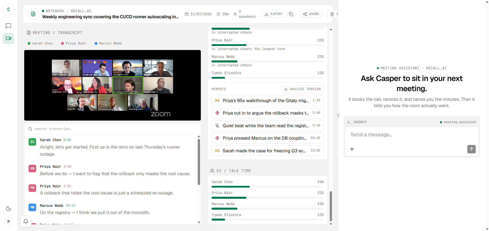
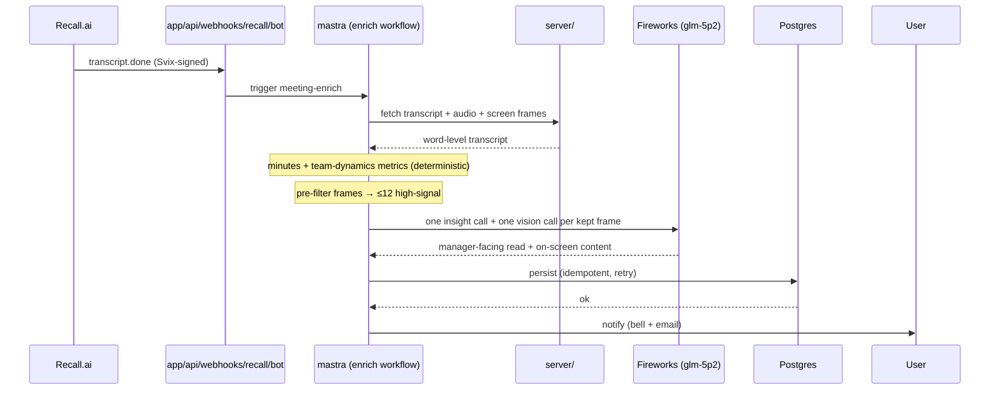
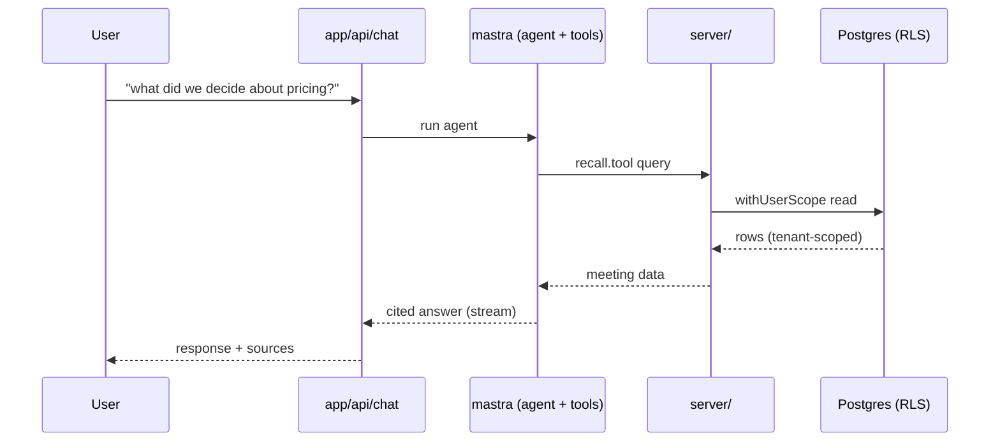
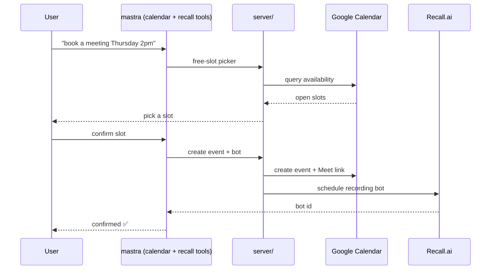

# 🛰️ Casper Agent — E2E Observability for a Real AI Agent

[](https://github.com/Michsantozz/karaforcasper/actions/workflows/ci.yml)


> **🏆 Agents of SigNoz — Track 01 · AI & Agent Observability.**
> **Three** of the track's example builds, in one project: **an AI agent with full E2E observability on SigNoz**, a **SRE Sidekick built on the SigNoz MCP**, and an **Observability Slackbot** (`@casper why did latency spike?` → the SRE-copilot investigates in SigNoz and answers in-thread). Not a toy instrumented for a demo — a **live, multi-tenant production app** whose every agent run, LLM call, tool, RAG hop, and workflow is traced, measured, and alertable in SigNoz.

**If you can't observe your AI agent, you don't own it.** Casper is a real meeting assistant (schedules bots, records calls, writes minutes, reads team dynamics) — and it is wired end-to-end into SigNoz so you can *see inside every autonomous decision it makes*. Then it closes the loop: a **SRE-copilot agent queries CasperAgent's own SigNoz telemetry over MCP**, provisions its own alerts, and watches its own health — an agent observing itself.
And it goes one step past observing: **telemetry-driven failover** — `createModel()`
reads the primary LLM provider's own error-rate/p95 back out of SigNoz and reroutes
to the fallback on its own when it's degraded, emitting a `model_failover` span. The
observability isn't just visible; it changes what the system does.



- 🌐 **Live app:** https://casper.careglyph.com
- 📊 **Observability guide (start here for judging):** [`SIGNOZ.md`](SIGNOZ.md)
- 💻 **Repo:** https://github.com/Michsantozz/karaforcasper

---

## 🔭 Best Use of SigNoz — the pitch

**One real agent. Every signal. A self-observing loop.** CasperAgent is instrumented **OpenTelemetry-native** — no proprietary SDK, the app just speaks standard OTLP (`http/protobuf`) and SigNoz is the sink. Everything below is **versioned as code** in [`deploy/signoz/`](deploy/signoz/) and reproducible.

**① Full E2E agent traces.** One trace per turn stitches the whole waterfall — `agent_run → model_generation → tool_call / retrieve → eval` — across Mastra's native spans *and* our own. Mastra's OTLP path silently drops parent spans and streaming token usage (two upstream gaps, diagnosed against the running stack); [`src/mastra/llm-telemetry.ts`](src/mastra/llm-telemetry.ts) forges the OTel parent context off Mastra's live `AISpan` so our self-instrumented LLM/tool/RAG/coverage spans join the *same* trace instead of standing up detached roots. Click a slow or errored turn → see the model call, the tools, the retrieval, and the answer-coverage score, all in one view.

**② Real `gen_ai.*` semconv — not estimates.** Every LLM span carries the OpenTelemetry GenAI conventions with the **real** provider usage: `gen_ai.request.model`, `gen_ai.usage.input_tokens` / `output_tokens`, `cache_read` / `cache_creation` tokens, `gen_ai.usage.cost` (computed from configured per-MTok prices, cache classes priced at their own rates), `gen_ai.server.ttft` (time-to-first-token, streaming), and `finish_reasons` as a real array (not a stringified `[object Object]`). Errors on both the generate **and** streaming paths emit an error span — including in-band SDK error parts that would otherwise mask as success.

**③ First-class metrics, cardinality-disciplined.** The same numbers mirror to OTLP metrics — token counters, cost, and an operation-**duration histogram with custom bucket boundaries** tuned for real LLM latency (0.5–60s), because the SDK's default buckets (≤10s) collapse every LLM call into the first two. Labels are a **closed low-cardinality set** (model / provider / token-type / bounded `error.type`) — no `user_id`, `meeting_id`, or prompt text ever touches a metric label. That series-explosion trap, avoided by construction.

**④ All three signals, correlated — logs deep-link to traces.** The failure logs aren't a separate stream you grep: each ERROR log record the app emits is **stamped with the failing span's `traceId`+`spanId`** ([`emitErrorLog`](src/mastra/llm-telemetry.ts)), so in SigNoz you click a log line and land on the exact failing LLM/tool/RAG span in the trace waterfall — *click a log, get its trace*. That's the "correlate signals across your stack" goal, built in, not bolted on.

**⑤ Dashboards, alerts & a trace funnel — versioned, and applied by one command.** A **30-panel** agent/LLM dashboard ([`deploy/signoz/dashboards/`](deploy/signoz/dashboards/)) spanning **traces, metrics *and* logs** panels, **10 alert rules** ([`deploy/signoz/alerts/`](deploy/signoz/alerts/)) — trace-based, metric-based, *and* logs-based, with trace/metric twins for cost/latency so an alert still fires if the metrics pipeline drops — and a **trace funnel** ([`deploy/signoz/funnels/`](deploy/signoz/funnels/)) modeling the real product agent's `plan → tool → generate` conversion/drop-off. `pnpm signoz:import` applies the whole set (channel → dashboard → rules, in dependency order, idempotent by name, `--dry-run` validates server-side first). Reproduced end-to-end via a SigNoz **Foundry casting spec** ([`deploy/signoz/casting.yaml`](deploy/signoz/casting.yaml) + `.lock`).

**⑥ Two rules that watch the watcher — including the one absence nothing else can see.** Every other rule in the pack fires on telemetry the agent *produces*, so when the self-observing loop breaks they all fall silent — and silence reads exactly like health. So the health-watch emits a **heartbeat span on every clean pass**, and [`health-watch-absent.json`](deploy/signoz/alerts/health-watch-absent.json) fires on its **absence** (SigNoz `condition.alertOnAbsent`), while its twin `health-watch-down.json` covers "it ran and failed". `alertOnAbsent` isn't in the public SigNoz docs — it was found and **calibrated empirically** against this deployment via `POST /api/v2/rules/test`: no data → `alertCount 0` without the flag, `1` with it, and the bucket width had to be measured too (step `900`/`1800` false-fire with a live heartbeat; `3600` is the first value that behaves). The measurements are recorded in the rule's own description.

**⑦ The self-observation loop — the SRE Sidekick.** A dedicated **SRE-copilot agent** ([`src/mastra/agents/sre.agent.ts`](src/mastra/agents/sre.agent.ts)) answers *"how many tokens did I spend today by model?"*, *"which tool is failing the most?"*, *"did any LLM call error in the last hour?"* by querying **CasperAgent's own SigNoz telemetry over the SigNoz MCP** — and its MCP toolset is itself wrapped in telemetry, so the copilot's own reads show up in the traces. On top: an **autonomous health-watch** runs every 15 min and a **weekly reliability report** — both emit their own spans, and the health-watch is *authorized to self-provision a SigNoz alert* when it spots a regression. **The agent observes itself, reasons over what it sees, and acts on it.**

**⑧ Observability ChatOps in Slack.** The same SRE-copilot is a **Slackbot** ([`src/mastra/channels-slack.ts`](src/mastra/channels-slack.ts)): mention or DM it — *`@casper why did latency spike?`* — and the message routes through Mastra's native channel pipeline into the copilot, which investigates over the SigNoz MCP and **streams the answer back into the thread** (live typing, tool calls shown inline). One brain, three surfaces — product chat, the 15-min cron, and Slack — never a second implementation. Safe no-op when `SLACK_BOT_TOKEN` is absent (no adapter, no route).

### Why not just import SigNoz's own Mastra template?

Fair question, and worth answering directly: SigNoz already ships dashboard templates for [Mastra](https://signoz.io/docs/dashboards/dashboard-templates/mastra-dashboard/) and for the [Vercel AI SDK](https://signoz.io/docs/dashboards/dashboard-templates/vercel-ai-sdk-dashboard/) — and this app runs on both. Those templates are a good baseline: token usage in/out, error rate, p95 latency, model distribution, agent invocations, tool calls. **Start there if you want agent observability in ten minutes.** Everything they cover, this project covers too.

The gap is what a template *cannot* know about your deployment, and it is exactly where the work here went:

| | Official template | This project |
|---|---|---|
| Tokens · error rate · p95 · tool calls | ✅ | ✅ |
| **Real USD cost** per call (per-provider prices, cache classes priced separately) | ✗ | ✅ |
| **TTFT**, cache-read / cache-creation tokens, normalized `finish_reasons` | ✗ | ✅ |
| **RAG retrieval hop** — latency, top similarity, empty-retrieval count | ✗ | ✅ |
| **Answer coverage** eval axis | ✗ | ✅ |
| **First-class OTel metrics** (counters + histogram with LLM-tuned buckets) | ✗ | ✅ |
| **Correlated ERROR logs** deep-linked to the failing span | ✗ | ✅ |
| **Pipeline conversion / drop-off** across the agent run | ✗ | ✅ |
| **Alerts** — trace/metric twins, logs-based, absence-based watchdog | ✗ | ✅ (10) |
| **Telemetry read back at runtime** to drive provider failover | ✗ | ✅ |

Some of that is missing from the template for a structural reason, not an oversight: Mastra's own `OtelExporter` implements no `onMetricEvent` and emits no cost, so a template reading Mastra's stock output *cannot* show either. Getting them required standing up a dedicated OTLP MeterProvider and computing cost per span app-side ([`llm-telemetry.ts`](src/mastra/llm-telemetry.ts)). Same story for the duplicate `model_generation` spans that version of the exporter emits — the panels here carry a `casper.self_instrumented` filter so aggregations don't silently double-count.

**→ Setup, import commands, and live verification: [`SIGNOZ.md`](SIGNOZ.md).**

---

## ✨ The real system under observation

Instrumentation is only as convincing as the system it observes — so Casper is a **genuinely useful, live product**, not a stub emitting fake spans. Every feature below is a real source of the agent runs, LLM calls, and tools you see in SigNoz.

**Meetings, end to end**
- **Schedule from chat** — "book a meeting Thursday 2pm" creates the Google Calendar event, the Meet link, and the recording bot in one shot (free-slot picker included).
- **Auto-record a whole calendar** — flip it on once and every future event with a meeting link gets a bot automatically (deduped, self-healing) — no per-meeting booking.
- **Send & control bots** on any Zoom/Meet/Teams call — send a bot, start/stop recording, remove it, all from chat.
- **Automatic minutes** — when the transcript lands, a webhook generates summary, decisions, action items, topics, and soundbites, then notifies you. No coming back to ask.
- **Screen Intelligence 👁️** — the transcript is blind to what's *on screen*: the number on the chart, the target on the slide, the error in the code. Casper's vision layer reads it. A **deterministic pre-filter** (zero LLM) scans the whole recording and picks only the handful of frames that actually matter — the first frame of each screen-share, moments where someone points at the screen (*"look here"*, *"olha esse número"* — PT-BR + EN deixis), and screens shown during acoustic-tension spikes — deduped and hard-capped at 12. Only those frames hit the Fireworks vision model, one call each, and it transcribes what's **literally** visible (never invents). A 90-minute call becomes ~8 vision calls, not 5,400 frames.
- **Meeting notebook** — synced player, karaoke transcript, decisions, moments, and one-click clips.
- **Ask across every meeting** — "what did we decide about pricing?" searches your whole history and cites the source.
- **Attach screenshots & PDFs to chat** — drop an image or PDF into the assistant and the vision model reasons over it (allowlisted, size-capped, rate-limited).
- **Share read-only, revocably** — publish a whole meeting (player, searchable karaoke transcript, decisions, talk-time) to anyone via an unguessable link, and revoke it anytime. No account needed on the other end.
- **Self-serve recovery** — the meetings list has server-side search, status filters, and infinite scroll; retry a failed enrichment or cancel a scheduled bot yourself, no support ticket.

**Team dynamics 🧠 — the differentiator**
- **Meeting-health dashboard** — talk-time per person, interruptions (who cut off whom), silences, monologues, and a participation **balance** score. Pure timestamp math: deterministic, no LLM, always on.
- **AI insight** — one Fireworks call turns the metrics into a manager-facing read ("one voice dominated; little pushback from the rest") and labels each moment with what happened + an emotional tone.
- **Acoustic tension detection** — on demand, Casper decodes the audio in your browser (WebCodecs, no upload) to tell *real* tension (loud, agitated overlap) from a casual "yeah, yeah". Tense moments get a 🔥.
- **Behavioral read** — the layer above tension: a Fireworks call interprets *what each tense moment reveals* about the people — pushback, frustration, disengagement, dominance, or healthy engagement — plus a manager-facing headline and 2-3 sentence arc ("Tense budget standoff: one voice pushed, the rest went quiet"). Grounded strictly in the tension signal + dynamics numbers, never invented. **Only numbers and short timing labels cross the wire** — no audio or video bytes ever leave the browser — so it's private *and* token-cheap (one call, top-10 moments).
- **Trends over time** (`/meetings/trends`) — who's fading out or taking over the room, rising friction, whether the team is getting more or less balanced — with signals the agent raises tactfully: *"Marina dropped from 22% to 4% over 6 meetings."*

Just ask: *"how did the team interact?"*, *"is anyone going quiet?"*, *"was there tension?"*

> **🔒 Honest scope.** Dynamics metrics and trends are deterministic math over transcript timestamps — reliable whenever word-level timing is present (Recall provides it). The AI *insight* (verified live against Fireworks `glm-5p2`) and *acoustic tension* pass are additive layers on top; neither is required for the core dashboard.

---

## 🚀 Why it stands out

- **Observable by construction, self-observing by design.** The whole agent stack is OTel-native and the SRE-copilot debugs it *with the same telemetry it emits* (over the SigNoz MCP) — the loop the "Agents of SigNoz" mission asks for: an agent you can actually see inside, that can see inside itself.
- **Behavior, not just content.** Others summarize *what* was said. Casper reads *how the team worked* — the layer Gong sells to sales teams, brought to everyday internal meetings.
- **Not one prompt — a supervised agent network.** A Casper supervisor routes per-meeting questions to a **Minutes** specialist and cross-meeting history/trends questions to a **Search** specialist, each with its own scoped toolset.
- **Remembers you.** A durable per-user profile (timezone, default duration, recording prefs) persists across every conversation, plus **semantic recall** over past chats (Fireworks embeddings → pgvector) — not a rolling last-N window.
- **Real product, not a demo.** Live deployment, multi-tenant by construction (Postgres RLS + ownership checks), Svix-signed fail-closed webhooks, and bounded app-level retries backed by **two independent recovery crons** (reconcile stuck rows + backfill missing ones).
- **Fireworks, used *intelligently* — not just called.** Every layer sends the model only what it can't compute for free. Team-dynamics metrics are pure timestamp math (talk-time, interruptions, silences) — **zero tokens**; Fireworks is spent on *one* insight call over the numbers, not on re-deriving them. Screen Intelligence pre-filters a whole recording down to ~12 high-signal frames deterministically, so the vision model reads a handful of screens instead of the video. Semantic recall embeds once per message and reuses it. The philosophy: **cheap deterministic work first, Fireworks only where judgment is genuinely needed** — the same token-efficient routing discipline the hackathon rewards, applied across the whole product.
- **Runs on AMD.** Chat, vision, embeddings, and the meeting-health insight all default to **Fireworks AI** (AMD hardware) — one key, one provider, swappable model via `FIREWORKS_MODEL_ID`.

---

## 🏗️ Tech stack

| Layer | Technology |
|---|---|
| App | Next.js 16, React 19 (App Router + RSC) |
| **Observability** | **OpenTelemetry-native → SigNoz** (traces · metrics · logs · dashboards · alerts · trace funnel · MCP) |
| Agent | Mastra (agents, tools, workflows) |
| LLM | **Fireworks AI** (default — chat, **vision**, embeddings, insight; on AMD) · AWS Bedrock fallback |
| Team dynamics | Deterministic timestamp analysis + Fireworks insight + browser audio (WebCodecs) |
| Screen Intelligence | Deterministic frame pre-filter (zero LLM) → Fireworks vision, ≤12 frames/call |
| Meetings | Recall.ai (REST + MCP), Google Calendar OAuth |
| Data | Postgres + Drizzle (multi-tenant RLS) |
| Workflows | Inngest (crons, reconcile loop) |
| Storage / Email | S3 / MinIO · Resend |

---

## ⚙️ How it works

**Schedule** → agent renders a free-slot picker, then creates the Calendar event + Meet link + bot in one call.

**After the meeting** → Recall fires a Svix-verified `transcript.done` webhook → enrichment runs (idempotent, with retry): minutes **+** team-dynamics metrics (deterministic, zero tokens) **+** one Fireworks insight call **+** Screen Intelligence (a whole recording pre-filtered to ≤12 frames, one Fireworks vision call each) — all persisted → you get a notification. A reconcile cron rescues anything that failed.

**Anytime** → ask the agent across your whole meeting history or about how a team is trending; reads are scoped to you and never leak across tenants.

---

## 📦 Setup

Requires **Node ≥ 24** and **pnpm**.

```bash
pnpm install
cp .env.example .env.local   # fill the required groups (see the annotated file)
pnpm db:migrate
pnpm dev                     # app
pnpm dev:inngest             # autonomous workflows (separate terminal)
```

**Required env** (grouped in `.env.example`): `DATABASE_URL` · auth (`BETTER_AUTH_URL`, `NEXT_PUBLIC_APP_URL`) · LLM (`MODEL_PROVIDER=fireworks`, `FIREWORKS_API_KEY`, `FIREWORKS_MODEL_ID`) · Recall (`RECALL_API_KEY`, `RECALL_WEBHOOK_SECRET`) · Google OAuth · S3/MinIO · `NEXT_SERVER_ACTIONS_ENCRYPTION_KEY`. Email (`RESEND_API_KEY`) is optional — without it the in-app bell still works.

**Recall webhooks** (Recall dashboard, same Svix secret): calendar → `{APP_URL}/api/webhooks/recall` · bot → `{APP_URL}/api/webhooks/recall/bot` (subscribe to `transcript.done`).

**Full self-host stack** (Postgres + MinIO + Inngest + app):

```bash
cp .env.example .env   # fill [SECRET] values
docker compose up -d --build
```

---

## 🧪 Commands

```bash
pnpm dev / dev:inngest   # dev server / workflows
pnpm build / start       # production
pnpm typecheck           # tsc --noEmit
pnpm lint                # ESLint (+ architecture boundary rules)
pnpm test                # Vitest (unit hermetic; integration/e2e opt-in)
pnpm db:migrate          # Drizzle migrations
```

Unit tests are hermetic (external services mocked). Live/E2E flows are opt-in (`RUN_LIVE_E2E=1`) and consume real API credits.

---

## 🛡️ Security

- **Passwordless magic-link sign-in** (email) — no password to leak; every route is auth-gated and user ids come from the session, never the request body.
- Meetings, threads, and uploads are per-user via Postgres **RLS** (`withUserScope`) + ownership checks (`assertBotOwner`) — cross-tenant reads 404, never leak. A boot guard warns if the DB role can bypass RLS.
- Webhooks are Svix-signed (HMAC-SHA256, timing-safe, anti-replay) and **fail-closed**.
- Uploads are MIME-allowlisted, size-capped, and rate-limited (DB-backed, shared across replicas); in chat, a forged `meetingBotId` is silently dropped unless you own the bot.
- A **per-user 24h cost ceiling** caps spend before generation and a token limiter caps each response — runaway cost can't happen.
- Optional LLM guardrails (`ENABLE_LLM_GUARDRAILS=true`) block prompt injection and redact PII on the chat agent.

---

## 📊 Observability internals (SigNoz)

The pitch is up top; this is where the signals live and how they're wired.

| What | Where |
|---|---|
| Self-instrumented LLM/tool/RAG/coverage spans + `gen_ai.*` metrics + correlated error logs | [`src/mastra/llm-telemetry.ts`](src/mastra/llm-telemetry.ts), [`src/mastra/agent-quality.ts`](src/mastra/agent-quality.ts) |
| SRE-copilot (queries own telemetry over SigNoz MCP, self-provisions alerts) | [`src/mastra/agents/sre.agent.ts`](src/mastra/agents/sre.agent.ts), [`src/mastra/mcp-signoz.ts`](src/mastra/mcp-signoz.ts) |
| Autonomous health-watch + weekly reliability report (own spans) | [`src/server/observability/`](src/server/observability/) |
| 30-panel agent/LLM dashboard (traces · metrics · logs) | [`deploy/signoz/dashboards/`](deploy/signoz/dashboards/) |
| 10 alert rules (trace + metric twins, logs-based, health-watch watchdog + absence rule) | [`deploy/signoz/alerts/`](deploy/signoz/alerts/) |
| One-command apply of every asset above (idempotent, `--dry-run`) | [`scripts/signoz-import.ts`](scripts/signoz-import.ts) — `pnpm signoz:import` |
| `plan → tool → generate` trace funnel | [`deploy/signoz/funnels/`](deploy/signoz/funnels/) |
| Reproducible SigNoz stack (server + MCP) | [`deploy/signoz/casting.yaml`](deploy/signoz/casting.yaml) |

**Signal coverage:** the app emits **traces, metrics, and logs** over OTLP (no proprietary SDK; SigNoz runs alongside Langfuse + PG). The versioned dashboard/alert/funnel pack drives deep on **all three** — trace, metric *and* logs panels, with logs-based alerting. The logs aren't just exported: each error log **carries the failing span's `traceId`+`spanId`**, so it deep-links to its trace in the waterfall — signals correlated, not siloed.

**→ Full guide, import commands, and live verification: [`SIGNOZ.md`](SIGNOZ.md).**

---

## 🧩 Architecture

Feature-based (FSD-flavored), colocated with the App Router, with layer boundaries **enforced by ESLint** (`eslint-plugin-boundaries` — a violating import fails `pnpm lint`). Next's `app/` files are thin shells that re-export the real logic from `_pages/` (page composition) and `_app/api-routes/` (route handlers). One unidirectional import flow: `app → _pages/_app → features/mastra → server/shared`, never the reverse.

| Layer | Owns | May import from |
|---|---|---|
| `app/` | Next routing only — thin shells re-exporting `_pages`/`_app` | `_pages`, `_app`, `features`, `mastra`, `server`, `shared` |
| `_pages/<slice>/` | Page logic behind each `app/**/page.tsx` | `features`, `shared` |
| `_app/api-routes/` | Route-handler logic behind each `app/api/**/route.ts` | `features`, `mastra`, `server`, `shared`, `inngest` |
| `features/<domain>/` | Business logic per domain (`ui/` `model/` `api/` + `index.ts` barrel) | `shared`, `auth` (cross-cutting) |
| `mastra/` | **The agent** — `agents/` `tools/` `workflows/` | `server`, `shared`, `auth`, `inngest` |
| `server/` | **server-only** — Recall.ai, storage, crypto (never reaches the client bundle) | `server`, `shared` |
| `shared/` | Generic, no business logic — `ui/` `lib/` `db/` (leaf) | `shared` only |
| `inngest/` | Cron-aware workflow builders (infra) | `inngest` only |

**Feature slices:** `meetings` · `notifications` · `auth` · `assistant`. `assistant` (chat orchestrator) may reach any slice; `auth` is cross-cutting. Everything else stays in its lane. Full rules in `CLAUDE.md`.

The flows below trace how these layers cooperate at runtime. Solid arrows are requests; dashed arrows are the responses flowing back.

### 🔄 Enrichment — after a meeting



### 💬 Chat — ask across meetings



### 📅 Schedule — book from chat



**Layer rules behind these flows:** unidirectional `app → _pages/_app → features/mastra → server/shared` (never the reverse). `shared/` is a leaf. `server/` is server-only — feature UI never imports it; only `_app/api-routes/*`, Server Actions, and `mastra/` reach it, and it alone talks to Recall.ai, Postgres, and S3. `mastra/` also fires Inngest crons (backfill · reconcile) that loop back to rescue lost webhooks.
